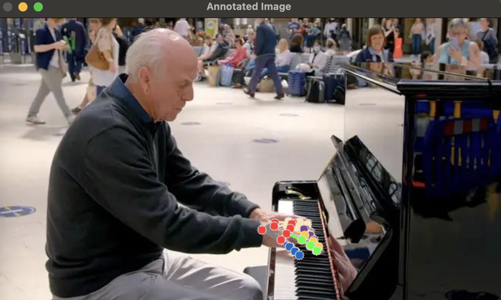
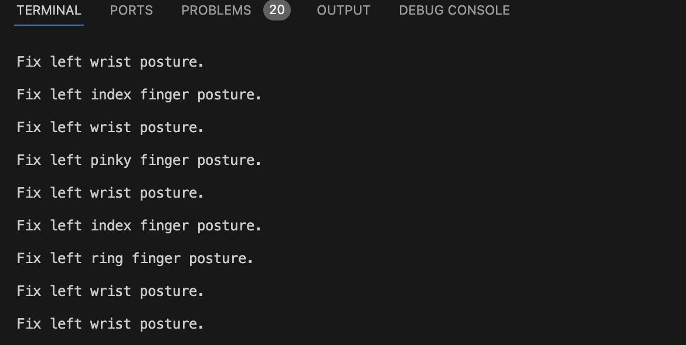

# Praxis 2
2024 ESC102 Praxis 2 Project

## Terminology

- coordinates: \
nomalized vector (x, y, z), where z in the distance to camera
- coordinates_world: \
normalized vector (x, y, z) in world coordinates
- landmarks(_world):\
 list of coordinates(_world)
## Index of Key Points
### Pose

Google Colab: Key Points of Pose
 https://blog.research.google/2020/08/on-device-real-time-body-pose-tracking.html

### Hand

MediaPipe: Key Points on Hand
https://developers.google.com/mediapipe/solutions/vision/hand_landmarker

## Feature
### Static input

### Webcam input

## Workplan
1. Refactor code for readbility
2. Unify container types with numpy for efficiency
3. Determine constants by testing
4. Visualize output
5. Posture log
6. User interface

